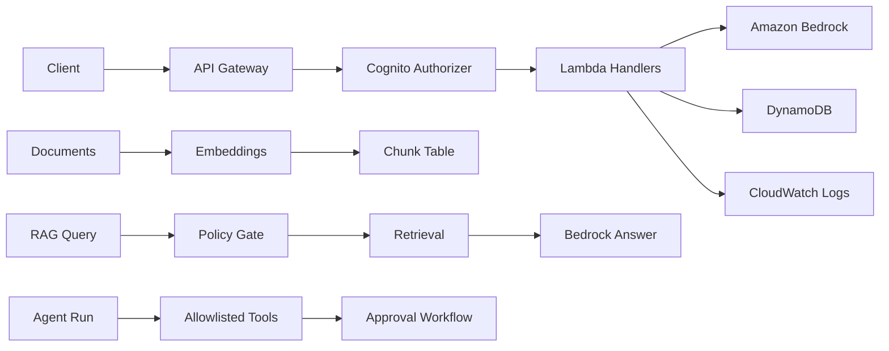

# AWS AI Platform PoC

## Overview

This repository demonstrates a controlled agentic RAG backend on AWS using API Gateway, Lambda, DynamoDB, CloudWatch Logs, Amazon Bedrock, and a Cognito authentication boundary.

The current PoC shows how authenticated callers can ingest documents, run grounded RAG queries, use a controlled agent with allowlisted tasks, and move proposed internal actions through a human approval workflow. It also demonstrates metadata and policy boundaries, application guardrails, request tracing, and a small regression evaluation path.

This repository is a learning and architecture PoC. It is not production-ready.

## Current Capabilities

- Serverless backend foundation with API Gateway, Lambda, DynamoDB, CloudWatch Logs, and AWS SAM
- Bedrock-backed `/chat` smoke-test endpoint
- Mini RAG flow with document ingestion, embeddings, metadata filtering, cosine similarity ranking, similarity threshold, and `no_source` behavior
- Metadata and policy boundary using `projectId`, `customerId`, and `documentType`
- Backend RAG policy gate that still validates requested project and customer scope
- Application input and output guardrails
- Trace records plus log helper scripts for operational visibility
- Controlled agent tasks: `answer_question`, `inspect_trace`, `search_logs`, `investigate_recent_blocks`, `propose_incident_report`
- Human approval workflow with approval records, decision, approved internal execution, and incident report creation
- Cognito authentication boundary for all current routes except `GET /health`
- Route-level permission checks for approval decision and approval execute
- Evaluation script for local regression checks against the deployed API

## Architecture



## Route Protection Summary

| Route | Protection | Notes |
| --- | --- | --- |
| `GET /health` | public | Public by design while the response stays non-sensitive. |
| `POST /echo` | Cognito protected | Debug-only endpoint. |
| `POST /chat` | Cognito protected | Smoke-test route only, not the controlled enterprise RAG path. |
| `POST /documents` | Cognito protected | Requires `Authorization: Bearer $AUTH_TOKEN`. |
| `POST /rag/query` | Cognito protected | RAG policy still checks project and customer scope after authentication. |
| `POST /agent/run` | Cognito protected | Controlled agent entrypoint. |
| `GET /approvals/{approvalId}` | Cognito protected | Approval read is authenticated, but not yet separately permission-scoped. |
| `POST /approvals/{approvalId}/decision` | Cognito protected plus `approvals:decide` | Route-level permission check is implemented. |
| `POST /approvals/{approvalId}/execute` | Cognito protected plus `approvals:execute` | Route-level permission check is implemented. |
| `GET /incident-reports/{reportId}` | Cognito protected | Incident report read is authenticated, but not yet separately permission-scoped. |

## Key Flows

### 1. Document Ingestion

`POST /documents` accepts a document payload, chunks the content, creates embeddings, and stores the chunk records in DynamoDB for later retrieval.

### 2. RAG Query

`POST /rag/query` authenticates the caller, resolves `AccessContext` from authorizer claims, checks requested project and customer filters against allowed scope, retrieves eligible chunks, ranks them by embedding similarity, and sends grounded context to Bedrock. If no chunk clears the similarity threshold, the route returns `no_source`.

### 3. Controlled Agent

`POST /agent/run` exposes a controlled agent with allowlisted tasks. Some tasks are read-oriented, while proposal-oriented tasks flow into the approval system instead of executing external actions directly.

### 4. Human Approval And Internal Execution

The approval workflow stores a proposal as an approval record, allows an authorized approver to decide, and then allows an authorized operator to execute the approved internal action. Existing state and action validation still apply after permission checks.

### 5. Authenticated Route Access

All current routes except `GET /health` are behind the Cognito authorizer. Protected routes use claims from `requestContext.authorizer.claims` to build `AccessContext`.

## Authentication And Authorization

Non-health routes are protected by API Gateway with a Cognito User Pool authorizer.

Protected routes use Cognito authorizer claims to build `AccessContext`. In token mode, caller-supplied `X-Allowed-*` headers do not override Cognito-derived claims.

The backend RAG policy boundary still enforces requested `projectId` and `customerId` scope after authentication, so an authenticated caller can still receive a backend `403` for out-of-scope access.

Route-level permission checks currently exist only for:

- `POST /approvals/{approvalId}/decision` requiring `approvals:decide`
- `POST /approvals/{approvalId}/execute` requiring `approvals:execute`

Current group-to-permission mapping includes:

- `ai-approver` granting `approvals:decide`
- `ai-operator` granting `approvals:execute`
- `ai-admin` granting all current route permissions

Broader route-level permission enforcement is future work.

Trusted-header fallback remains for local compatibility, but protected routes use Cognito authorizer claims as the active authority.

## Evaluation

The repository includes [scripts/run_rag_eval.py](scripts/run_rag_eval.py) for regression-style checks against the deployed API.

The script supports token-based calls through `AUTH_TOKEN` and can also use `AUTHORIZATION_HEADER` when needed.

In token mode, the evaluation intentionally skips `Q006` because it is a trusted-header spoofing test and Cognito claims are the active authority on protected routes.

Expected token-mode result:

```text
Skipping Q006 in token mode because trusted-header spoofing is not the active auth source.
RAG evaluation complete: 15/15 cases passed.
Skipped cases: 1
```

## Deployment

From the repository root:

```bash
sam build --template-file infra/cloudformation/template.yaml
sam deploy --guided --template-file infra/cloudformation/template.yaml
```

Useful CloudFormation outputs to capture after deployment:

- `API_BASE_URL`
- `USER_POOL_ID`
- `USER_POOL_CLIENT_ID`

## Basic Test Commands

Health remains public:

```bash
curl -i -sS "$API_BASE_URL/health"
```

Protected route without token is rejected:

```bash
curl -i -sS \
  -X POST "$API_BASE_URL/rag/query" \
  -H "Content-Type: application/json" \
  -d '{
    "question": "What does API Gateway do?",
    "filters": {
      "projectId": "learning",
      "customerId": "internal"
    }
  }'
```

Authenticated document ingestion:

```bash
curl -i -sS \
  -X POST "$API_BASE_URL/documents" \
  -H "Content-Type: application/json" \
  -H "Authorization: Bearer $AUTH_TOKEN" \
  -d @test-data/requests/document-request.json
```

Authenticated RAG query:

```bash
curl -i -sS \
  -X POST "$API_BASE_URL/rag/query" \
  -H "Content-Type: application/json" \
  -H "Authorization: Bearer $AUTH_TOKEN" \
  -d '{
    "question": "What does API Gateway do?",
    "filters": {
      "projectId": "learning",
      "customerId": "internal"
    }
  }'
```

Authenticated echo test:

```bash
curl -i -sS \
  -X POST "$API_BASE_URL/echo" \
  -H "Content-Type: application/json" \
  -H "Authorization: Bearer $AUTH_TOKEN" \
  -d '{"message":"hello world"}'
```

Token-mode evaluation:

```bash
AUTH_TOKEN="$AUTH_TOKEN" python scripts/run_rag_eval.py
```

Do not paste passwords, full JWTs, or other secrets into commands, screenshots, or committed files.

## Important Limitations

- This repository is not production-ready.
- Retrieval still uses DynamoDB scan plus in-Lambda vector similarity.
- The current auth flow uses an ID token for PoC convenience.
- No production IdP federation is implemented.
- No route-level OAuth scope enforcement is implemented yet.
- Only approval decision and approval execute currently have route-level permission checks.
- `trusted_headers` fallback remains for local compatibility.
- `/chat` is a smoke-test endpoint only.
- `/echo` is a debug-only endpoint.
- No WAF, CloudTrail security dashboard, or equivalent hardening layer is implemented yet.
- No external ticket creation, email sending, or shell execution is performed by this PoC.

## Recommended Next Phase

Phase 9A - Observability and Security Audit Dashboard Design
