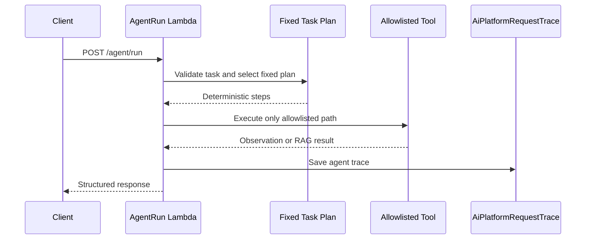
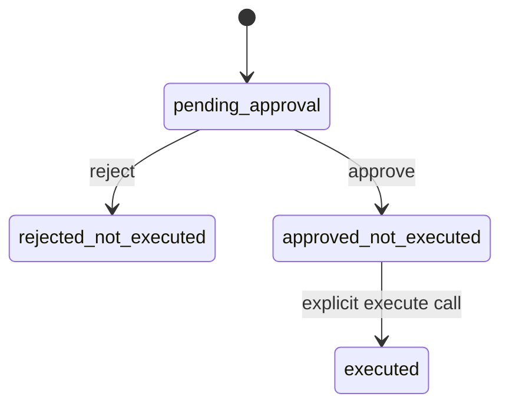

# Agent Workflow And Approval Boundary

## Purpose

This document explains the current agent implementation after Phase 6G.

The most important design rule is that the agent is an orchestrator, not a free-running LLM runtime.

It is bounded by:

- fixed tasks
- allowlisted tools
- deterministic control flow
- trace persistence
- approval records
- explicit execution checks

## Agent Entry Point

The agent entry point is:

- `POST /agent/run`

Handled by:

- `backend/lambda/agent_run/handler.py`

The handler validates the incoming task, builds a deterministic plan, executes only the code path allowed for that task, writes an agent trace, and returns a structured response.

## Supported Tasks

The current task inventory is defined in `backend/lambda/common/agent.py`.

| Task | Purpose | Mode |
| --- | --- | --- |
| `answer_question` | Use the shared RAG pipeline to answer a grounded question | `read_only` |
| `inspect_trace` | Fetch and summarize a trace record by request ID | `read_only` |
| `search_logs` | Search recent CloudWatch log events using a preset | `read_only` |
| `investigate_recent_blocks` | Run a bounded two-tool investigation over blocked requests | `read_only` |
| `propose_incident_report` | Build an approval-bound action proposal | `approval_required` |

## Allowlisted Tools

Current tool allowlist:

| Tool | Used by | Behavior |
| --- | --- | --- |
| `rag_query` | `answer_question` | Calls the shared controlled RAG path |
| `trace_lookup` | `inspect_trace`, `investigate_recent_blocks` | Reads one trace record from DynamoDB |
| `log_search` | `search_logs`, `investigate_recent_blocks` | Reads recent log events from CloudWatch Logs |

All current tools are read-only tools.

## Agent Flow

## Read-only RAG Through The Agent

For `answer_question`, the agent does not build its own retrieval logic.

It calls `common.rag_service.run_rag_query()` through the allowlisted `rag_query` tool path and then writes a separate agent trace describing the tool call and response.

This keeps the RAG logic centralized and prevents the agent path from drifting into a second retrieval implementation.

## Multi-tool Investigation

`investigate_recent_blocks` is the first multi-tool orchestration path.

Current behavior:

1. run `log_search` with preset `blocked`
2. extract a limited number of candidate request IDs
3. run `trace_lookup` for those IDs
4. summarize blocked reasons in a bounded response

This is agentic in the orchestration sense, but still narrow and deterministic.

## Proposal Workflow

`propose_incident_report` is the current action-like task.

It does not execute anything directly.

Current behavior:

1. run the bounded blocked-request investigation
2. build an incident report proposal from observed evidence
3. persist an approval record
4. return `approval_required` status with `approvalId`

The proposed action currently uses action type:

- `create_incident_report`

## Approval Boundary

Approval is handled outside `/agent/run` through:

- `GET /approvals/{approvalId}`
- `POST /approvals/{approvalId}/decision`

Approval lifecycle:

Key rule:

Approval opens the gate. It does not execute by itself.

## Approved Internal Executor

The executor endpoint is:

- `POST /approvals/{approvalId}/execute`

It is handled by `backend/lambda/approvals/handler.py` and is still tightly scoped.

Before execution, it validates:

1. the approval record exists
2. approval status is `approved`
3. execution status is `approved_not_executed`
4. proposed action type is `create_incident_report`

Only if all four checks pass does it continue.

## What Execution Actually Does

Current execution does one internal write only:

- create a new incident report record in DynamoDB

The report is written through `common.incident_report_repository` and includes:

- `report_id`
- `approval_id`
- `source_request_id`
- `created_at`
- `created_by`
- `title`
- `summary`
- `severity`
- `recommended_next_steps`
- `status`

After that write succeeds, the approval record is updated to `executed` and stores an execution result payload that includes the report ID.

## Incident Report Read Path

The created report can be read through:

- `GET /incident-reports/{reportId}`

Handled by:

- `backend/lambda/incident_reports/handler.py`

This endpoint is read-only and returns the stored internal incident report record.

## Boundary Summary

The current agent boundary is deliberate:

- read-only tools were built first
- action proposals require human approval
- approval does not execute
- execution is separate and explicitly validated
- execution is restricted to one allowlisted internal action type
- external writes remain out of scope

## Current Out-of-scope Actions

The current system does not allow the agent or executor to:

- send email
- create Jira tickets
- call external APIs for action execution
- run shell commands
- mutate arbitrary infrastructure or data stores

That is a feature of the design, not a missing implementation detail.