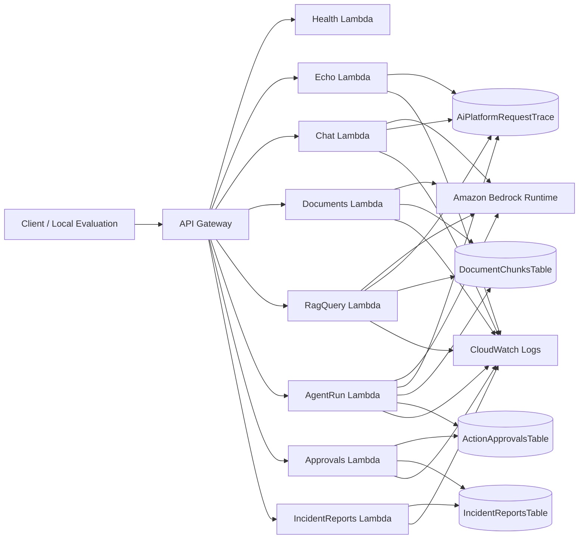

# Architecture Blueprint

## Purpose

This document describes the current AWS AI Platform PoC after Phase 6G.

The implementation is intentionally small and explicit:

- Amazon API Gateway exposes the HTTP surface.
- AWS Lambda hosts each endpoint handler.
- DynamoDB stores traces, document chunks, approval records, and internal incident reports.
- Amazon Bedrock Runtime is used only for chat, embeddings, and grounded answer generation.
- CloudWatch Logs captures runtime logs and supports local log inspection helpers.
- AWS SAM / CloudFormation defines the deployed resources.

This is a backend learning PoC, not a production reference architecture.

## Logical Architecture

## Endpoint Inventory

| Endpoint | Lambda handler | Main common/service path | Primary AWS integrations |
| --- | --- | --- | --- |
| `GET /health` | `backend/lambda/health/handler.py` | `common.response` | API Gateway |
| `POST /echo` | `backend/lambda/echo/handler.py` | `common.trace_repository`, `common.logging` | DynamoDB trace, CloudWatch Logs |
| `POST /chat` | `backend/lambda/chat/handler.py` | `common.bedrock_client`, `common.trace_repository`, `common.logging` | Bedrock Converse, DynamoDB trace, CloudWatch Logs |
| `POST /documents` | `backend/lambda/documents/handler.py` | `common.chunking`, `common.document_repository`, `common.embedding_client`, `common.logging` | Bedrock embedding, DynamoDB document chunks, CloudWatch Logs |
| `POST /rag/query` | `backend/lambda/rag_query/handler.py` | `common.rag_service` | DynamoDB document chunks, Bedrock embedding, Bedrock Converse, DynamoDB trace, CloudWatch Logs |
| `POST /agent/run` | `backend/lambda/agent_run/handler.py` | `common.agent`, `common.rag_service`, `common.trace_lookup`, `common.log_search`, `common.investigation`, `common.action_proposal` | DynamoDB trace, DynamoDB approvals, CloudWatch Logs, Bedrock for `rag_query` task |
| `GET /approvals/{approvalId}` | `backend/lambda/approvals/handler.py` | `common.approval_repository` | DynamoDB approvals |
| `POST /approvals/{approvalId}/decision` | `backend/lambda/approvals/handler.py` | `common.approval_repository` | DynamoDB approvals |
| `POST /approvals/{approvalId}/execute` | `backend/lambda/approvals/handler.py` | `common.approval_repository`, `common.incident_report_repository` | DynamoDB approvals, DynamoDB incident reports |
| `GET /incident-reports/{reportId}` | `backend/lambda/incident_reports/handler.py` | `common.incident_report_repository` | DynamoDB incident reports |

## DynamoDB Tables

### `AiPlatformRequestTrace`

Purpose:

- Store request-level traces for `echo`, `chat`, `rag/query`, and `agent/run`.
- Preserve request ID correlation, guardrail results, retrieval details, answer preview, and agent tool activity.

Key:

- `request_id` as hash key.

### `DocumentChunksTable`

Purpose:

- Store chunked document content.
- Store embedding vectors.
- Store metadata boundaries used by retrieval: `project_id`, `customer_id`, and `document_type`.

Key:

- `document_id` as hash key.
- `chunk_id` as range key.

### `ActionApprovalsTable`

Purpose:

- Store proposed actions created by the agent.
- Store approval and rejection decisions.
- Store execution state transitions such as `pending_approval`, `approved_not_executed`, and `executed`.

Key:

- `approval_id` as hash key.

### `IncidentReportsTable`

Purpose:

- Store internal incident report records created by the executor.
- Preserve the link from execution back to the approval record and source request.

Key:

- `report_id` as hash key.

## Main Runtime Paths

### RAG path

`POST /rag/query` enters `rag_query.handler.lambda_handler`, which validates the request and delegates to `common.rag_service.run_rag_query`.

That service performs:

1. header-based access context resolution
2. input guardrail evaluation
3. metadata filtering over DynamoDB chunk records
4. query embedding generation
5. cosine similarity ranking with thresholding
6. no-source handling when nothing qualifies
7. grounded prompt construction
8. Bedrock Converse answer generation
9. output guardrail evaluation
10. trace persistence and CloudWatch logging

### Agent path

`POST /agent/run` enters `agent_run.handler.lambda_handler` and routes to one of five supported tasks:

- `answer_question`
- `inspect_trace`
- `search_logs`
- `investigate_recent_blocks`
- `propose_incident_report`

The agent is not a free-running planner. It uses a fixed task inventory, a fixed tool allowlist, and deterministic control logic.

### Approval and execution path

The action path is split deliberately:

1. `/agent/run` with `propose_incident_report` creates a proposal and approval record.
2. `POST /approvals/{approvalId}/decision` records human approval or rejection.
3. `POST /approvals/{approvalId}/execute` validates approval state and action type.
4. Only then is an internal incident report record written to DynamoDB.

Approval does not execute by itself.

## Platform Boundaries

Current boundaries are explicit:

- Only the listed API endpoints exist.
- Only Lambda functions in the SAM template are deployed.
- The agent tool allowlist is limited to `rag_query`, `trace_lookup`, and `log_search`.
- The only internal execution path is `create_incident_report`.
- No email, Jira, ticketing, external API call, or shell execution exists.

## Current Limitations

The current implementation is intentionally narrow:

- Retrieval uses DynamoDB scan plus in-Lambda cosine similarity rather than a managed vector index.
- Authorization is header-based and intended for learning, not production identity.
- Bedrock permissions are wildcard-scoped in the PoC template for simpler setup.
- Observability relies on DynamoDB trace records, CloudWatch Logs, and local scripts rather than dashboards and alarms.
- Execution has no idempotency key, retry workflow, or external system integration.
- Agent behavior is orchestrated logic, not a managed agent runtime.

## Current vs Future

Current implementation is limited to the services and flows above.

Future changes such as managed vector retrieval, real authentication, production approval roles, and external workflow integrations are roadmap items and are not part of the current deployed design.