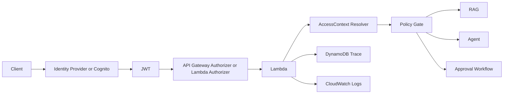

# Authentication and Authorization Design

## Purpose

This document designs the next security boundary after Phase 7.

The current trusted header model is useful for learning because it makes the policy decision path visible in the backend. It is not acceptable as a production authentication and authorization boundary.

This document is design-only. It does not claim that Cognito, JWT validation, authorizers, or claim-based authorization are implemented in the current repository.

## Current Implementation

The current PoC uses a learning-only header model:

- the caller sends `X-User-Id`
- the caller sends `X-Allowed-Project-Ids`
- the caller sends `X-Allowed-Customer-Ids`
- the backend resolves an access context from request headers in `backend/lambda/common/policy.py`
- the policy gate validates requested `projectId` and `customerId` filters against that access context
- the metadata filter limits eligible chunks before similarity ranking
- this demonstrates policy behavior, but it does not authenticate the caller

Current effective flow:

1. client sends request and trusted headers
2. Lambda resolves access context from headers
3. policy gate compares requested filters to allowed scope
4. metadata filter constrains eligible chunks
5. retrieval proceeds only if scope is allowed

What this proves today:

- the policy gate sits before retrieval
- denied scope fails before Bedrock-backed answer generation
- metadata and policy are separate concerns

What this does not prove today:

- that the caller identity is real
- that the allowed scope came from a trusted source
- that the request is tied to a verified token, user lifecycle, or central identity system

## Problem Statement

Trusted caller-provided headers are not enough for a real authentication and authorization boundary because:

- the client can forge headers
- there is no token signature validation
- there is no issuer, audience, or expiration check
- there is no real user lifecycle
- there is no central identity provider
- there is no audit-grade authentication boundary

The current header model is therefore a teaching mechanism, not a security control that should be trusted in production.

## Target Design Principles

- Authentication must happen before application policy.
- Authorization scope must come from verified claims or a trusted policy lookup.
- Backend policy should consume an `AccessContext` object, not raw user-controlled headers.
- Missing, malformed, or untrusted authorization scope must fail closed.
- After verified claims are introduced, caller-provided `X-Allowed-*` headers must not be trusted.
- Metadata filtering and policy gate must remain in the backend.
- Denied scope must fail before retrieval and before Bedrock.
- Trace must record the authenticated user and authorization decision.
- Keep `/chat` as smoke test or protect it consistently depending on route policy.
- Authorizer validates identity; backend policy still validates requested `projectId` and `customerId` filters.

## Target Logical Architecture

Target control order:

1. token or caller identity is validated at the API boundary
2. verified claims are passed into the backend
3. backend normalizes those claims into an `AccessContext`
4. policy gate evaluates requested scope against allowed scope
5. metadata filter constrains eligible chunks
6. retrieval and Bedrock calls happen only after auth and policy checks succeed

## Option A: Cognito User Pool Authorizer

When to use it:

- when the platform can use an AWS-native user directory
- when JWT claim validation should be handled at the API layer
- when the project wants a learning-first path that matches common AWS patterns

Benefits:

- AWS-native approach with standard JWT validation
- built-in issuer and token validation model
- simpler than a custom authorizer for common identity cases
- good fit for a learning phase that wants verified claims without building custom auth logic first

Limitations:

- claim structure is shaped by Cognito and token configuration
- custom enterprise claim mapping may be awkward
- external policy lookups are not handled by the built-in authorizer itself
- more advanced authorization still has to happen in the backend after authentication

Recommendation note:

This is the recommended learning-first AWS-native path if the next phase wants the shortest route from trusted headers to verified JWT-backed identity.

## Option B: Lambda Authorizer

When to use it:

- when claim mapping must be customized heavily
- when enterprise IdP integration is required
- when external policy lookup is needed before the request reaches the main handler
- when the project needs more control over principal derivation than a managed authorizer provides

Benefits:

- flexible claim normalization and principal construction
- can integrate with enterprise IdP patterns and external policy sources
- can attach a normalized context payload for backend use
- useful when access scope should be resolved from something more complex than token claims alone

Limitations:

- more moving parts than a managed authorizer
- custom code becomes part of the security boundary
- higher testing and operational burden
- poor authorizer design can create inconsistent auth behavior across routes

Recommendation note:

This is useful when custom claim mapping, enterprise IdP support, or external policy lookup is needed, but it is a heavier path than a Cognito user pool authorizer.

## Option C: HTTP API JWT Authorizer

This option may be relevant if the API type is HTTP API.

If the current template remains REST API, this stays a future migration option rather than the immediate next step.

When to consider it:

- if the platform later migrates to HTTP API
- if the simplified JWT authorizer model is a better operational fit for the target architecture

Benefits:

- simpler JWT-focused authorizer path for HTTP APIs
- lighter-weight route protection model in some deployments

Limitations:

- depends on API type choice
- not directly the current path if the stack stays on the present REST-style API definition

## Recommended Phase 8 Path

- 8A: design docs only
- 8B: introduce `AccessContext` abstraction and tests while keeping headers
- 8C: add JWT and authorizer infrastructure
- 8D: switch policy context from trusted headers to verified claims
- 8E: evidence run for auth success and deny cases

Why this order is practical:

- it separates backend refactoring from infrastructure change
- it keeps the current policy logic visible while the abstraction changes
- it allows claim-based auth to be introduced without rewriting the metadata and policy model
- it supports an evidence phase after the auth boundary changes

## Candidate Route Permission Scopes

The following scope names are target design candidates for future phases.

They are not implemented in the current repository.

- `rag:query`
- `documents:write`
- `agent:run`
- `approvals:read`
- `approvals:decide`
- `approvals:execute`
- `incident-reports:read`

## Route Protection Matrix

| Route | Current auth | Target auth | Candidate scope | Authorization rule | Notes |
| --- | --- | --- | --- | --- | --- |
| `GET /health` | none | public or explicitly internal-only, depending on platform policy | none if public; otherwise platform-specific internal operational scope | if public, keep it non-sensitive; if protected, require valid authenticated caller | It may remain public only if it returns no sensitive information. Otherwise it should be protected for internal operational use. |
| `POST /echo` | none | verified authenticated caller | platform-specific internal testing scope if retained | allow authenticated internal testing caller; no RAG scope logic required | Useful as a low-risk authenticated trace example if retained. |
| `POST /chat` | none | either public smoke test or verified authenticated caller | none if public smoke test; otherwise platform-specific route scope | no document-scope authorization if kept as smoke test; otherwise protect consistently with route policy | `/chat` is not the controlled RAG path. |
| `POST /documents` | none | verified authenticated caller with ingestion permission | `documents:write` | allow only callers permitted to create or replace document chunks for allowed tenant or project scope | Ingestion should not remain open in a real environment. |
| `POST /rag/query` | learning-only trusted headers | verified authenticated caller plus backend policy gate | `rag:query` | requested filters must be within allowed project and customer scope derived from verified claims or trusted lookup | Deny before retrieval and before Bedrock. Backend policy gate remains required after auth. |
| `POST /agent/run` | learning-only trusted headers for shared RAG path | verified authenticated caller plus task-aware authorization | `agent:run` | authenticated caller required; `answer_question` uses same scope boundary as RAG; proposal tasks require permitted investigation and proposal role | Tool allowlist remains separate from auth. Backend policy gate still applies to shared RAG usage. |
| `GET /approvals/{approvalId}` | none | verified authenticated caller with approval read access | `approvals:read` | allow only authorized reviewer, operator, or owner according to target approval policy | Ownership or role rule should be explicit in a future phase. |
| `POST /approvals/{approvalId}/decision` | none | verified authenticated caller with approval decision permission | `approvals:decide` | allow only reviewers or approvers authorized to decide the pending approval | Approval and execution remain separate. |
| `POST /approvals/{approvalId}/execute` | none | verified authenticated caller with execution permission | `approvals:execute` | allow only authorized executor after approval state and action type validation pass | Auth does not replace executor validation. |
| `GET /incident-reports/{reportId}` | none | verified authenticated caller with report read access | `incident-reports:read` | allow only authorized caller for the report's tenant, customer, or operational role | Report lookup should not remain open in a real environment. |

## Trace and Audit Requirements

Future auth-aware traces and logs should record enough data to explain both identity and authorization outcome.

Required fields:

- `authenticatedUserId`
- `authSource`
- `tokenIssuer`
- `tokenAudience`
- `principalId`
- `allowedProjectIds`
- `allowedCustomerIds`
- `requestedFilters`
- `authorizationDecision`
- `denialReason`
- `requestId`
- `task` or `actionType` if applicable

Design note:

These are target audit requirements for future phases. They are not all present in the current trace schema.

## Current Boundaries That Must Remain

- metadata filter remains
- policy gate remains
- input guardrail remains
- output guardrail remains
- tool allowlist remains
- approval does not auto-execute
- executor validates state and action type

## Non-goals for Phase 8A

- no production Cognito deployment yet
- no real IdP integration yet
- no code change yet
- no external write action
- no replacement of RAG or vector implementation yet