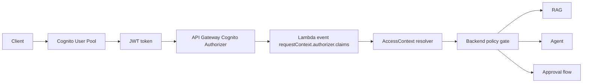

# Cognito Authorizer Implementation Plan

## Purpose

This document plans the move from `mock_authorizer_claims` to real Cognito and API Gateway authorizer integration.

The goal is to define the safest next implementation step after the Phase 8E claims resolver work. This document is planning-only. It does not claim that Cognito, JWT validation, or API Gateway authorizer infrastructure is implemented in the current repository.

## Current State

The current repository state is:

- trusted headers still exist for learning and demo compatibility
- `mock_authorizer_claims` resolver support exists through `requestContext.authorizer.claims`
- the backend policy gate consumes `AccessContext`
- no real Cognito, JWT validation, or API Gateway authorizer exists yet

What this means in practice:

- the backend already knows how to consume identity and scope from an `AccessContext`
- the current trust boundary is still not real
- the next phase should add infrastructure carefully without breaking the currently working PoC and evaluation flow

## Target Architecture

Target control order:

1. the client authenticates with Cognito
2. the client sends a JWT in the `Authorization` header
3. API Gateway Cognito authorizer validates the token before Lambda runs
4. API Gateway passes claims into `requestContext.authorizer.claims`
5. the backend `AccessContext` resolver maps those claims into the internal auth context
6. the backend policy gate still validates requested `projectId` and `customerId` filters before retrieval or downstream execution

## Recommended First Protected Route

The first protected route should be `POST /rag/query` only.

Why this is the best first boundary:

- it is the highest-value security boundary in the current PoC
- it already has a backend policy gate for `projectId` and `customerId`
- it has clear allowed and denied evidence paths
- it avoids breaking all demo and evaluation flows at once
- it keeps the first Cognito change narrow enough to debug quickly

Initial route posture recommendation:

- protect `POST /rag/query` first
- keep `GET /health` public
- keep all other routes unchanged initially
- expand protection only after the first route is stable and evidence-backed

## Token Choice

For this PoC, the first implementation should use a Cognito ID token in the `Authorization` header.

Practical reasoning:

- the first protected route needs user identity plus project and customer claims
- Cognito custom user attributes are easier to surface in the ID token than in the access token for a small PoC
- the backend already expects claim-like data for `user_id`, project scope, and customer scope
- this keeps the first implementation focused on claim mapping instead of OAuth scope modeling

Important nuance:

- API Gateway Cognito authorizer can validate a token supplied in the `Authorization` header
- if method-level scopes are introduced later, that usually pushes the design toward access-token scopes rather than ID-token-only authorization
- for this PoC, starting with an ID token is a practical first step for custom claim mapping, not a statement of production-best-practice for every system

Recommended first-token approach:

- use ID token first for the `/rag/query` learning implementation
- keep `scope` support in `AccessContext` for future access-token or hybrid authorization work
- revisit access-token scope enforcement after the first Cognito-backed route is stable

## Required Cognito Claims

Required claims for the first implementation:

- `sub`
- `preferred_username` or `username`
- `custom:project_ids`
- `custom:customer_ids`

Optional claims for later or for richer trace context:

- `scope`
- `cognito:groups`
- `email`

Why these claims matter:

- `sub` provides the stable principal identifier
- `preferred_username` or `username` supports human-readable trace context
- `custom:project_ids` and `custom:customer_ids` preserve the existing backend scope model
- optional `scope` and `cognito:groups` allow later route-level and role-level authorization growth without changing the `AccessContext` shape again

## Claim Population Strategy

There are several ways to populate Cognito-backed authorization scope.

Option 1: custom attributes in the Cognito user pool

- store project scope in `custom:project_ids`
- store customer scope in `custom:customer_ids`
- use manually configured test users at first

Option 2: group-based mapping later

- use Cognito groups for coarse role membership
- derive project and customer scope from groups in a later phase if needed

Option 3: pre-token generation trigger later

- enrich tokens dynamically before issue time
- useful if scope must be derived from a system of record rather than static user attributes

Recommendation for the first implementation:

- use custom attributes for project and customer IDs
- manually configure a small number of test users for the first protected-route rollout
- defer group-derived scope and pre-token generation triggers until after the first evidence-backed Cognito phase

This is the simplest path because it minimizes moving parts while preserving the current backend policy contract.

## SAM / CloudFormation Change Plan

This section describes planned changes only. It is not implementation code.

Planned infrastructure steps:

- add a Cognito User Pool
- add a Cognito User Pool Client
- add a Cognito authorizer under `AWS::Serverless::Api` `Auth` `Authorizers`
- configure the `/rag/query` event to use that authorizer first
- keep `/health` public
- keep other routes unchanged initially

SAM-specific note:

- AWS SAM Cognito authorizer configuration uses `UserPoolArn` under API `Auth` `Authorizers`

Implementation discipline:

- do not broaden route protection in the same change that introduces the first Cognito authorizer
- do not couple the first Cognito rollout to unrelated API cleanup
- keep the template diff as small and reviewable as possible

## Backend Change Plan

Expected backend changes should be minimal.

- ideally no change is needed in `rag_service.py` or `agent_run/handler.py`
- `AccessContext` already understands `requestContext.authorizer.claims`
- a minor claim-shape adjustment may be needed after confirming the exact API Gateway event format
- trusted-header fallback should remain for local development and demo compatibility
- the backend policy gate must remain in place

Important boundary rule:

- Cognito authorizer verifies identity at the API boundary
- backend policy still verifies requested `projectId` and `customerId` filters against the allowed scope from claims

## Evaluation Script Impact

Existing evaluation currently assumes callable endpoints without Cognito protection.

If `/rag/query` becomes protected, `scripts/run_rag_eval.py` will likely need optional token support so it can send an `Authorization` header.

Recommended options:

- support `AUTHORIZATION_HEADER="Bearer <token>"`
- or support `AUTH_TOKEN="<token>"` and construct the header internally

Why this matters:

- the eval script must be able to run against protected `/rag/query`
- the same script may still need to support unprotected or local compatibility modes during rollout
- token handling should be optional rather than mandatory until route protection expands

## Evidence Plan

The next implementation phase should collect evidence for all of the following:

- unauthenticated `/rag/query` returns `401` or `403` before Lambda
- authenticated allowed `/rag/query` returns `completed` with sources
- authenticated mismatched project returns `403` from the backend policy gate
- missing custom project or customer claims fail closed
- trace records include `auth_source` and user context if that data is recorded in traces
- evaluation passes with token-enabled mode

Evidence sequence recommendation:

1. prove unauthenticated denial at the API boundary
2. prove authenticated allowed request with correct scope
3. prove authenticated mismatched scope denial from backend policy
4. prove missing-claim fail-closed behavior
5. prove evaluation still passes in token-enabled mode

## Rollback Plan

If the first protected-route rollout causes disruption:

- disable the authorizer on the `/rag/query` route
- redeploy the previous SAM template
- keep the trusted-header resolver path available
- rerun `run_rag_eval`

Rollback intent:

- restore the currently working demo and evaluation flow quickly
- avoid forcing all local and internal users to acquire tokens before the first rollout is proven stable

## Risks and Mitigations

- token acquisition complexity: provide a small internal runbook for obtaining a test token before enabling the first protected-route evidence run
- custom claims not appearing in token: validate actual token contents early with a single test user before wiring all evidence scripts
- ID token vs access token confusion: document clearly which token the first phase expects and why
- evaluation script breakage: add optional token support before or alongside route protection
- route protection applied too broadly: protect only `/rag/query` first
- false confidence if backend policy gate is skipped: keep the existing backend policy gate unchanged after authorizer integration
- claim shape mismatch in API Gateway event: confirm the real event payload from API Gateway before finalizing any claim-name assumptions

## Non-goals

- no implementation in 8G
- no production IdP federation
- no full route protection
- no removal of trusted headers
- no external policy store
- no production readiness claim

## Proposed Next Phase

Phase 8H should implement a Cognito authorizer for `POST /rag/query` only.