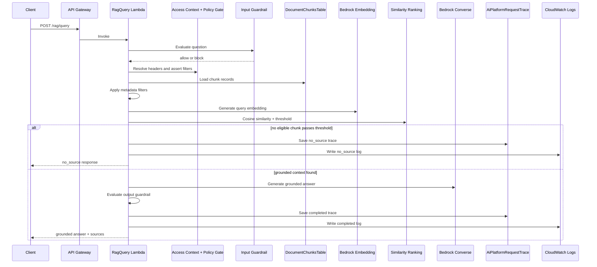

# Controlled Agentic RAG Pipeline

## Purpose

This document explains how the current PoC answers questions through a controlled retrieval-augmented generation path.

The key point is simple:

- the system does not let an LLM act freely
- the RAG path is bounded by validation, guardrails, policy checks, metadata boundaries, trace persistence, and evaluation

## Core Entry Point

The primary RAG implementation lives in `backend/lambda/common/rag_service.py`.

It is used by:

- `POST /rag/query` through `backend/lambda/rag_query/handler.py`
- `POST /agent/run` when the task is `answer_question`

This keeps direct RAG usage and agent-mediated RAG usage on the same runtime path.

## Step-by-step Pipeline

### 1. Request validation

`rag_query.handler.lambda_handler` validates that the request contains a non-empty `question` and optional structured `filters`.

The agent path validates its task first, then passes `question` and `filters` into the same shared RAG service.

### 2. Access context resolution

`common.policy.resolve_access_context` reads:

- `X-User-Id`
- `X-Allowed-Project-Ids`
- `X-Allowed-Customer-Ids`

This produces a simple caller context used later by the policy gate.

### 3. Input guardrail

`common.guardrails.evaluate_input_guardrail` checks the incoming question before retrieval begins.

Current blocked categories are:

- prompt injection patterns
- unsafe data access patterns

If the input is blocked:

- the request returns status `blocked`
- Bedrock is not called
- sources are empty
- a trace record is still written

### 4. Policy gate

`common.policy.assert_filters_allowed` validates the requested `projectId` and `customerId` against the allowed scope from headers.

If the requested scope is not allowed:

- the request returns `403`
- retrieval does not continue

This is a learning-only policy gate, not a production authorization model.

### 5. Metadata filtering

The RAG service loads all chunks through `common.document_repository.DocumentRepository.list_chunks()` and then applies metadata filtering with `_filter_chunks_by_metadata()`.

Supported filter fields are:

- `projectId`
- `customerId`
- `documentType`

The current order matters:

1. load chunks
2. enforce metadata eligibility
3. score only eligible chunks

### 6. Embedding retrieval

`common.embedding_client.EmbeddingClient.embed_query()` generates the question embedding.

`common.retrieval.retrieve_top_chunks()` computes cosine similarity against chunk embeddings and returns up to three top chunks.

### 7. Similarity threshold

The retrieval step enforces `MIN_SIMILARITY_SCORE`, currently set from Lambda environment variables and defaulting to `0.25`.

Chunks below that threshold are discarded before answer generation.

### 8. No-source behavior

If no chunk passes the metadata and similarity checks:

- the response returns `status: no_source`
- the answer is `I do not know based on the available documents.`
- Bedrock Converse is not called
- the trace records a no-source outcome

This is one of the most important control points in the current design.

### 9. Grounded prompt construction

If matching chunks exist, `_build_grounded_prompt()` creates a prompt that:

- includes selected chunk content
- includes source tags with `documentId` and `chunkId`
- instructs the model to answer only from provided context
- instructs the model to refuse when the answer is not in context

### 10. Bedrock Converse

`common.bedrock_client.BedrockClient.converse()` calls Amazon Bedrock Runtime to generate the grounded answer.

The PoC currently uses Bedrock Runtime only for:

- `POST /chat`
- document embedding generation
- grounded answer generation in the RAG path

### 11. Output guardrail

`common.output_guardrails.evaluate_output_guardrail()` validates the model answer after generation.

Current checks include:

- empty answer warning
- missing source reference warning when sources exist

Current behavior is warning-oriented rather than blocking.

### 12. Trace persistence

The RAG service builds a structured trace record and stores it in DynamoDB through `common.trace_repository.TraceRepository`.

Trace fields include:

- request metadata
- filters
- guardrail result
- output guardrail result
- retrieval mode
- similarity threshold
- eligible chunk count
- source count
- source list
- answer preview
- latency

### 13. CloudWatch logging

The same path logs structured runtime events to CloudWatch Logs.

This supports:

- blocked-request inspection
- no-source inspection
- latency inspection
- error inspection

## RAG Flow Diagram

## How the Agent Uses RAG

The agent does not implement a second RAG pipeline.

For `task: answer_question`:

1. `backend/lambda/agent_run/handler.py` validates the task.
2. It builds a deterministic plan from `common.agent.build_plan()`.
3. It calls `common.rag_service.run_rag_query(..., save_trace=False)`.
4. It records a separate agent trace describing the tool call and final answer.

The tool call is represented as `rag_query` and remains read-only.

## Why This Is Controlled, Not Free-running

The current pipeline is controlled because:

- task names are fixed
- tools are allowlisted
- input is validated before model use
- access scope is checked before retrieval
- retrieval is metadata-bound and threshold-bound
- no-source responses avoid unsupported generation
- output is checked after generation
- traces and logs provide auditability
- local evaluation tests regression across known cases

## Current Limitations

- Full-table chunk scanning is acceptable only at PoC scale.
- Header-based access control is not a production authorization model.
- Output guardrails warn but do not enforce a hard block.
- Retrieval uses a simple top-k approach without reranking.
- The agent uses the same RAG path only for the `answer_question` task.