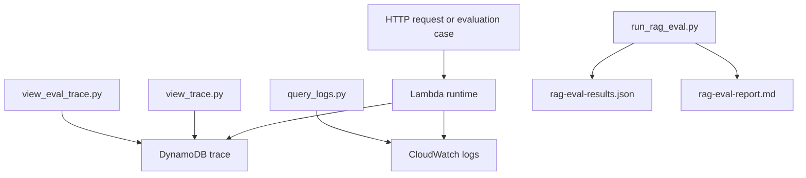

# Observability And Evaluation

## Purpose

This PoC uses a small but useful observability model:

- DynamoDB trace records for request-level inspection
- CloudWatch Logs for runtime event inspection
- local scripts for trace lookup, log lookup, and evaluation
- local evaluation reports for regression checking

This is enough to debug the current learning flows without adding more AWS services.

## DynamoDB Trace

The request trace table is the main durable inspection surface.

Current traces capture different slices depending on the endpoint, including:

- request ID
- timestamp
- path
- question or message
- filters
- guardrail results
- retrieval details
- answer preview
- latency
- agent task and tool-call metadata
- proposed action metadata

The trace table is especially useful when you want to inspect one request across API response, retrieval behavior, and agent behavior.

## CloudWatch Logs

CloudWatch Logs captures runtime logs for the Lambdas.

This is useful for:

- blocked request review
- no-source review
- latency review
- error review
- runtime troubleshooting that is broader than one request ID

The current agent `log_search` tool also depends on the log stream for bounded inspection.

## Local Helper Scripts

### View one trace by request ID

Script:

- `scripts/view_trace.py`

Command:

```bash
python3 scripts/view_trace.py --request-id <requestId>
```

Optional table override:

```bash
python3 scripts/view_trace.py --request-id <requestId> --table-name ai-platform-request-trace-dev
```

### View trace starting from an evaluation case

Script:

- `scripts/view_eval_trace.py`

Commands:

```bash
python3 scripts/view_eval_trace.py --case-id Q007
python3 scripts/view_eval_trace.py --case-id Q009
```

Optional overrides:

```bash
python3 scripts/view_eval_trace.py --case-id Q015 --results-file reports/rag-eval-results.json --table-name ai-platform-request-trace-dev
```

### List Lambda log groups from the stack

Script:

- `scripts/get_lambda_log_groups.py`

Command:

```bash
python3 scripts/get_lambda_log_groups.py --stack-name aws-ai-platform-poc-dev
```

### Run CloudWatch Logs Insights queries

Script:

- `scripts/query_logs.py`

Command examples:

```bash
python3 scripts/query_logs.py --log-group "/aws/lambda/<lambda-name>" --preset raw --start-minutes-ago 60
python3 scripts/query_logs.py --log-group "/aws/lambda/<lambda-name>" --preset blocked --start-minutes-ago 120
python3 scripts/query_logs.py --log-group "/aws/lambda/<lambda-name>" --preset no-source --start-minutes-ago 120
python3 scripts/query_logs.py --log-group "/aws/lambda/<lambda-name>" --preset errors --start-minutes-ago 120
python3 scripts/query_logs.py --log-group "/aws/lambda/<lambda-name>" --preset latency --start-minutes-ago 120
python3 scripts/query_logs.py --log-group "/aws/lambda/<lambda-name>" --preset guardrails --start-minutes-ago 120
python3 scripts/query_logs.py --log-group "/aws/lambda/<lambda-name>" --preset summary --start-minutes-ago 120
```

Current Logs Insights presets implemented by the script are:

- `raw`
- `summary`
- `blocked`
- `no-source`
- `errors`
- `latency`
- `guardrails`

## Local RAG Evaluation

The evaluation runner is:

- `scripts/run_rag_eval.py`

It replays the cases from `test-data/rag-evaluation/questions.json` against the deployed API.

Run it with:

```bash
export API_BASE_URL="https://<api-id>.execute-api.<region>.amazonaws.com/v1"
python3 scripts/run_rag_eval.py
```

The evaluation currently covers:

- in-source answers
- semantic retrieval
- no-source behavior
- policy denial
- input guardrail blocking
- output guardrail observation
- read-only agent tasks
- approval workflow
- approved internal execution flow

## Evaluation Reports

The evaluation produces:

- `reports/rag-eval-results.json`
- `reports/rag-eval-report.md`

The current checked-in report shows a successful `16/16` run for the present deployment context. That should be treated as a point-in-time artifact, not a permanent guarantee for every environment.

## Observability Flow



## What The Current Signals Tell You

| Signal | Current source | Why it matters |
| --- | --- | --- |
| `requestId` | API responses and trace table | Correlates request, trace, and logs |
| guardrail result | response, trace, logs | Explains blocked behavior |
| policy result | HTTP response and trace context | Explains denied scope |
| source list and similarity | response and trace | Explains retrieval behavior |
| `no_source` status | response, trace, logs | Proves model was skipped when evidence was insufficient |
| agent tool calls | agent trace | Explains agent orchestration path |
| approval status | approval table | Shows human decision lifecycle |
| execution status | approval table | Shows whether approved action was executed |
| report ID | execute response and report table | Links execution to the created internal artifact |

## Current Gaps

The current observability model is useful but still limited:

- no CloudWatch dashboard
- no CloudWatch alarms
- no explicit token or cost tracking
- no distributed tracing
- no long-term retention design
- no per-user operational metrics
- no trend view for retrieval quality over time

## Recommended Next Observability Upgrades

These are future upgrades, not current features:

1. Standardize the trace schema across all endpoint families.
2. Add CloudWatch metrics for blocked, denied, no-source, error, and execution events.
3. Add dashboards for latency, errors, guardrails, and approval/execution counts.
4. Add alarms for abnormal block rates, no-source spikes, and executor failures.
5. Add token usage and estimated cost tracking for Bedrock-backed flows.
6. Add a retention and archive strategy for trace and approval records.