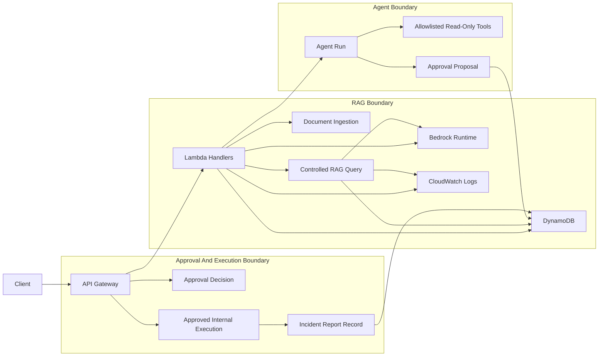

# Phase 7 Final Summary

## Purpose

This document summarizes the current AWS AI Platform PoC after the architecture checkpoint, traceability review, demo walkthrough, evidence run, and demo cleanup.

It is a documentation-level summary of what is actually implemented now, what was demonstrated with evidence, what was adjusted during demo cleanup, and what still remains outside the current PoC boundary.

Related Phase 7 architecture references:

- `docs/ARCHITECTURE_BLUEPRINT.md`
- `docs/ARCHITECTURE_TO_CODE_TRACEABILITY.md`
- `docs/ENDPOINT_FLOW_MAP.md`

## Current Platform Summary

The current PoC is a controlled AWS serverless backend with these implemented elements:

- AWS serverless backend foundation through API Gateway, Lambda, DynamoDB, and CloudWatch Logs
- Bedrock chat through `POST /chat`
- embedding-based mini RAG through `POST /documents` and `POST /rag/query`
- metadata boundary through `projectId`, `customerId`, and `documentType`
- header-based learning policy gate through `X-User-Id`, `X-Allowed-Project-Ids`, and `X-Allowed-Customer-Ids`
- input/output guardrails in the shared RAG path
- request trace persistence and CloudWatch log evidence
- read-only agent tools for `rag_query`, `trace_lookup`, and `log_search`
- multi-tool investigation through `investigate_recent_blocks`
- human approval workflow for proposed write actions
- approved internal executor for incident report record creation

## Logical Architecture

## Implemented Capabilities

| Capability | Endpoint/script | Evidence | Notes |
| --- | --- | --- | --- |
| health | `GET /health` | Real response captured in `docs/evidence/PHASE_7D_EVIDENCE_RUN.md` | Returns static service metadata with `status=ok`. |
| chat | `POST /chat` | Real smoke-test response captured in `docs/evidence/PHASE_7D_EVIDENCE_RUN.md` | Basic Bedrock inference endpoint only. |
| document ingestion | `POST /documents` | Demo walkthrough and evidence run both show successful indexing | Stores chunk content, embeddings, and metadata in DynamoDB. |
| RAG success | `POST /rag/query` | Demonstrated in `docs/evidence/PHASE_7D_EVIDENCE_RUN.md` | Returns grounded answer with sources when eligible chunks exist. |
| blocked guardrail | `POST /rag/query` | Demonstrated in `docs/evidence/PHASE_7D_EVIDENCE_RUN.md` | Input guardrail blocks unsafe prompts before retrieval/model answer generation. |
| `no_source` | `POST /rag/query` | Demonstrated in `docs/evidence/PHASE_7D_EVIDENCE_RUN.md` | No-source response avoids unsupported grounded answer generation. |
| policy denied | `POST /rag/query` | Demonstrated in `docs/evidence/PHASE_7D_EVIDENCE_RUN.md` | Header-derived access context denies disallowed retrieval scope with HTTP `403`. |
| agent `answer_question` | `POST /agent/run` | Demonstrated in `docs/evidence/PHASE_7D_EVIDENCE_RUN.md` | Uses allowlisted `rag_query` path in read-only mode. |
| agent `inspect_trace` | `POST /agent/run` | Demonstrated in `docs/evidence/PHASE_7D_EVIDENCE_RUN.md` | Uses `trace_lookup` to inspect one prior trace. |
| agent `search_logs` | `POST /agent/run` | Demonstrated in `docs/evidence/PHASE_7D_EVIDENCE_RUN.md` | Uses `log_search` over bounded recent events. |
| agent `investigate_recent_blocks` | `POST /agent/run` | Demonstrated in `docs/evidence/PHASE_7D_EVIDENCE_RUN.md` | Chains `log_search` and `trace_lookup`. |
| `propose_incident_report` | `POST /agent/run` | Demonstrated in `docs/evidence/PHASE_7D_EVIDENCE_RUN.md` | Creates a pending approval for internal action type `create_incident_report`. |
| approval decision | `POST /approvals/{approvalId}/decision` | Demonstrated in `docs/evidence/PHASE_7D_EVIDENCE_RUN.md` | Approval changes state but does not execute the action. |
| approved execution | `POST /approvals/{approvalId}/execute` | Demonstrated in `docs/evidence/PHASE_7D_EVIDENCE_RUN.md` | Executor validates approval state and action type before writing. |
| incident report lookup | `GET /incident-reports/{reportId}` | Demonstrated in `docs/evidence/PHASE_7D_EVIDENCE_RUN.md` | Fetches stored internal incident report record. |
| evaluation | `scripts/run_rag_eval.py` | Real evidence run records `16/16 cases passed` | Exercises selected evaluation flows across RAG, agent, approval, and execution behavior. |
| trace viewer | `scripts/view_trace.py`, `scripts/view_eval_trace.py` | Demonstrated in Phase 7 walkthrough and evidence pack | Supports request-level trace inspection from DynamoDB. |
| log query helper | `scripts/get_lambda_log_groups.py`, `scripts/query_logs.py` | Demonstrated in Phase 7 walkthrough and evidence pack | Provides log discovery and query-backed evidence collection. |

## Key Architecture Principles Learned

- LLM is not the platform.
- similarity decides relevance.
- metadata decides eligibility.
- policy decides allowed scope.
- no source means no grounded answer.
- agent is not a free-running LLM.
- tools must be allowlisted.
- read-only first, write action later.
- approval does not automatically execute.
- executor must validate state and action type.
- trace before production.
- evaluation before confidence.

## Current Boundaries

- `/chat` is a smoke-test Bedrock endpoint, not controlled enterprise RAG.
- header-based policy is for learning only.
- document chunks are stored in DynamoDB for PoC learning.
- retrieval uses scan plus in-Lambda similarity ranking.
- current guardrails are application-level simple checks.
- output guardrail warns but does not block.
- executor only creates an internal DynamoDB incident report.
- no external email, Jira, shell, or other system write action exists.

## Phase 7 Evidence Summary

Phase 7D completed a real evidence run across the current endpoints, agent flows, approval flow, internal execution flow, traces, logs, and evaluation script.

That evidence run also surfaced a useful demo observation: direct RAG success and agent `answer_question` were using different effective metadata assumptions. Phase 7E then cleaned up the demo metadata alignment by introducing demo-specific request files that align document ingestion and controlled RAG filters for the walkthrough path.

Relevant Phase 7 evidence and demo references:

- `docs/evidence/PHASE_7D_EVIDENCE_RUN.md`
- `docs/DEMO_WALKTHROUGH.md`
- `docs/EVIDENCE_PACK_AFTER_6G.md`

## Remaining Gaps Before Production

- real authentication and authorization
- API Gateway authorizer or Cognito/JWT
- replacing trusted headers with claims
- least privilege IAM hardening
- managed or scalable vector store
- S3 document ingestion
- document versioning
- better citation quality
- Bedrock managed guardrails
- CloudWatch dashboards and alarms
- cost and token tracking
- CI/CD and regression automation
- production incident workflow design

## Recommended Next Phase

Phase 8A — Real Authentication and Authorization Boundary Design

This is the next defensible step because the current PoC already demonstrates retrieval controls, agent boundaries, approval separation, and evidence capture. The largest remaining architectural gap is replacing trusted demo headers with a real identity and authorization boundary.