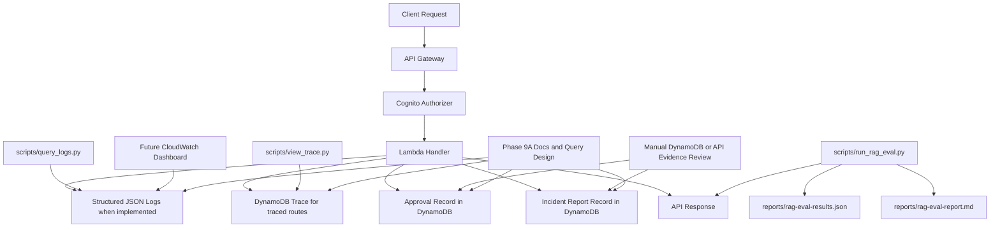

# Phase 9A Observability and Security Audit Dashboard Design

## Purpose of Phase 9A

Phase 9A defines the next observability and audit layer for the current AWS AI Platform PoC.

The purpose is not to add a new runtime stack or claim a deployed dashboard. The purpose is to describe a practical operator-facing view of what the current PoC already emits through DynamoDB trace records, CloudWatch Logs, approval records, incident report records, and local evaluation artifacts.

This phase also defines the event shape and query patterns needed to make future dashboard work more consistent without changing the core platform behavior described in Phase 8S.

## Current Observability Baseline

Current observability signals already present in the repository:

- DynamoDB trace records for `/echo`, `/chat`, `/rag/query`, and `/agent/run`
- CloudWatch Logs for Lambda runtime behavior across the deployed handlers
- Structured JSON logging through `common.logging.log_json()` where implemented
- Local helper scripts for trace inspection, log group discovery, Logs Insights queries, and evaluation review
- Evaluation artifacts under `reports/` produced by `scripts/run_rag_eval.py`

What operators can inspect today:

- request status such as `completed`, `blocked`, `no_source`, `denied`, and `failed` where structured logging already exists
- request ID, route path, user ID, filters, guardrail outcome, and latency for the RAG path
- agent task, tool calls, matched log events, and bounded investigation summaries in agent traces
- approval records in DynamoDB and incident report records in DynamoDB after explicit execution

Important current gaps:

- no deployed CloudWatch dashboard resource exists yet
- no CloudWatch alarms are defined yet
- approval and incident report handlers do not yet emit the same structured log shape used by the RAG and agent paths
- not every route writes a trace record today

## Current Security and Audit Baseline

Current PoC security and audit posture relevant to dashboarding:

- all non-health routes are Cognito protected
- `AccessContext` resolves Cognito authorizer claims on protected routes
- `X-Allowed-*` headers do not override Cognito claims in token mode
- the RAG path still enforces project and customer policy after authentication
- input guardrails can block unsafe requests before retrieval and model use
- output guardrails currently warn rather than hard-block
- the agent is constrained to fixed tasks and allowlisted tools
- approval decision requires `approvals:decide`
- approval execute requires `approvals:execute`
- execution remains limited to the internal action type `create_incident_report`
- execution only creates an internal DynamoDB incident report record

This means the current audit story is already useful, but it is still uneven. The RAG and agent flows are more observable than the approval and internal execution flows.

## Dashboard Goals

The Phase 9A dashboard design should help an operator answer six practical questions:

1. Is the platform currently healthy and responding?
2. Is the RAG path producing grounded answers, `no_source` outcomes, or unusual failure patterns?
3. Are authentication and backend policy boundaries denying requests as expected?
4. Are guardrails blocking suspicious or unsafe requests at a rate that deserves review?
5. What tools and tasks is the controlled agent actually using?
6. Which approvals and internal executions happened, and what internal record was created?

## Dashboard Views

### Platform Runtime Health

Purpose:
Track route volume, latency, and error patterns across the currently deployed Lambda handlers.

Signals to use now:

- CloudWatch Logs for request counts, error messages, and latency fields where present
- Lambda log groups for `/chat`, `/documents`, `/rag/query`, `/agent/run`, `/echo`, `/approvals`, and `/incident-reports`
- DynamoDB trace counts for the routes that persist traces

What an operator should learn:

- which routes are active
- which routes are failing
- whether latency is increasing on the RAG or agent paths
- whether a route is quiet because it is unused or because observability is incomplete

### RAG Quality and Grounding

Purpose:
Show whether the RAG path is answering with sources, returning `no_source`, or failing before model use.

Signals to use now:

- `status` values from RAG logs and traces
- `eligible_chunk_count`, `source_count`, and `latency_ms` where structured fields exist
- evaluation output from `scripts/run_rag_eval.py`

What an operator should learn:

- whether grounded answers are being produced
- whether `no_source` is rising because retrieval quality is weak or document coverage is missing
- whether evaluation remains stable in token mode with `15/15` passed and `1` skipped

### Security Boundary and Policy Denial

Purpose:
Make authentication and backend authorization denials visible without confusing them with validation or runtime failures.

Signals to use now:

- API-level no-token rejections from route testing and auth evidence
- RAG log events with `status="denied"`
- route protection posture from the Phase 8 final auth evidence
- permission-denied outcomes for approval decision and execute

What an operator should learn:

- whether requests are being denied at the right layer
- whether policy denials are increasing for project or customer scope mismatches
- whether approval permission checks are actively preventing invalid operator or approver actions

### Guardrail and Abuse Detection

Purpose:
Surface prompt injection attempts, unsafe data access attempts, and warning-oriented output issues.

Signals to use now:

- `guardrail_action`, `guardrail_reason`, and `guardrail_matched_rule` from RAG logs and traces
- output guardrail fields such as `output_guardrail_action`, `output_guardrail_reason`, and `output_guardrail_warnings`
- blocked-request investigations through the agent's `investigate_recent_blocks` task

What an operator should learn:

- which input guardrail rules are matching most often
- whether blocked requests are isolated or recurring
- whether output warnings are occurring on otherwise successful RAG responses

### Agent Tool Execution

Purpose:
Show what the controlled agent is doing without pretending it is a free-running runtime.

Signals to use now:

- agent traces from `/agent/run`
- structured logs from `agent_run.handler`
- task names, tool calls, matched event counts, and investigation summaries

What an operator should learn:

- which agent tasks are being used
- whether tool calls are succeeding or failing
- whether investigations are bounded and producing expected read-only behavior
- whether approval-required proposals are being created instead of executed directly

### Approval and Internal Action Audit

Purpose:
Track proposed actions, decisions, execution attempts, successful execution, and created incident reports.

Signals to use now:

- approval records in DynamoDB
- incident report records in DynamoDB
- approval and execution API responses
- evaluation results covering approval and execution flows

What an operator should learn:

- how many approvals were created
- which approvals were approved or rejected
- which approved actions were executed
- which incident reports were created by execution

Current limitation:
Approval and incident report flows do not yet emit the same structured `log_json()` events used by the RAG path, so dashboarding for this slice is partly design-forward and currently relies more on DynamoDB records than on normalized CloudWatch log events.

## Observability and Audit Flow

The diagram below shows the full observability and audit picture, but it intentionally separates CloudWatch-log-driven dashboarding from DynamoDB-backed companion evidence.

## Current PoC Scope vs Future Production Scope

| Area | Current PoC scope | Future production-oriented scope |
| --- | --- | --- |
| Dashboarding | Design only in this phase | Deployed CloudWatch dashboards, alarms, and retention controls |
| Runtime signals | Logs, traces, approvals, incident reports, evaluation artifacts | Standardized metrics, alarms, and broader cross-service observability |
| Auth visibility | Cognito boundary is implemented and evidenced | Stronger route-level authorization metrics and identity lifecycle reporting |
| Audit normalization | Mixed today; strongest in RAG and agent paths | Consistent event schema across all routes and action flows |
| Security signals | Policy deny, guardrail block, approval permission outcomes | WAF, CloudTrail, anomaly alerts, and richer security analytics |
| Distributed tracing | Not implemented | X-Ray or OpenTelemetry if later justified |
| Cost and token usage | Not implemented as dashboard metrics | Explicit Bedrock token and cost observability if added later |

The production-oriented column is design guidance only. It is not implemented by this phase.

## Acceptance Criteria

Phase 9A is acceptable when:

- the design clearly explains the current observability baseline without claiming a deployed dashboard
- the design clearly explains the current security and audit baseline
- the six requested dashboard views are defined in practical operator terms
- current PoC scope is separated from future production hardening
- the design stays grounded in current repository behavior, especially CloudWatch Logs, DynamoDB traces, approvals, and incident reports
- the design does not claim CloudTrail, WAF, OpenSearch, Bedrock Knowledge Bases, or Bedrock managed observability are currently implemented
- the design keeps `/chat` as a smoke-test endpoint and keeps the approval executor limited to internal incident report creation

## Recommended Follow-on Work

After this design phase, the next low-risk implementation slices would be:

1. standardize explicit audit event emission for approval and incident report flows
2. add CloudWatch dashboard JSON or IaC only after the event fields are stable
3. add alarms for deny spikes, block spikes, and execution failures after baseline noise is understood
