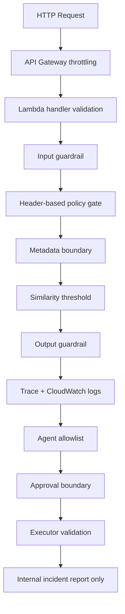

# Security And Guardrails

## Purpose

This document summarizes the current control surface in the AWS AI Platform PoC after Phase 6G.

The design goal is practical containment:

- reduce accidental overreach
- keep the runtime explicit
- make risky paths auditable
- separate current controls from production-grade replacements

## Current Control Layers

### 1. API throttling

The SAM template configures API Gateway stage throttling through:

- `ApiStageThrottleRateLimit`
- `ApiStageThrottleBurstLimit`

This protects the PoC from simple request spikes before Lambda is invoked.

### 2. Least-privilege per function

Each Lambda receives only the IAM permissions it needs for the current PoC flow.

Examples:

- `EchoFunction` can write only to the trace table.
- `ApprovalsFunction` can read and update approvals and write incident reports.
- `IncidentReportsFunction` can only read the incident report table.

Bedrock access is still wildcard-scoped in the PoC template for simpler setup and should be narrowed later.

### 3. Metadata boundary

Document chunks store:

- `project_id`
- `customer_id`
- `document_type`

`common.rag_service` filters chunk eligibility by these metadata values before similarity ranking.

This creates a basic content boundary even within the learning retrieval design.

### 4. Header-based policy gate

The policy gate reads:

- `X-User-Id`
- `X-Allowed-Project-Ids`
- `X-Allowed-Customer-Ids`

and rejects disallowed `projectId` and `customerId` filters before retrieval continues.

Important:

This is learning-only authorization. It is useful for demonstrating control points, but it is not a real security boundary for production.

### 5. Input guardrail

`common.guardrails.evaluate_input_guardrail()` blocks obvious unsafe requests before retrieval and Bedrock use.

Current rule families:

- prompt injection phrases
- unsafe data access phrases

If triggered:

- the request is blocked
- no retrieval continues
- no model answer is generated
- a trace and logs are still produced

### 6. Similarity threshold

The retrieval path enforces `MIN_SIMILARITY_SCORE`.

This is a retrieval quality control rather than a classic security control, but it still matters because it reduces weak or misleading context from reaching the model.

### 7. Output guardrail

`common.output_guardrails.evaluate_output_guardrail()` checks the generated answer for:

- empty answer
- missing source references when sources exist

Current behavior is `warn` or `allow`, not hard blocking.

### 8. Tool allowlist

The agent does not receive arbitrary tools.

Current allowlisted tools in `common.agent` are:

- `rag_query`
- `trace_lookup`
- `log_search`

All are read-only tools.

### 9. Approval boundary

Action-like behavior is separated into stages:

1. proposal
2. human decision
3. explicit execution call

Approval alone does not execute anything.

### 10. Executor validation

The internal executor in `backend/lambda/approvals/handler.py` validates all of the following before writing an incident report record:

1. approval record exists
2. approval status is `approved`
3. execution status is `approved_not_executed`
4. proposed action type is `create_incident_report`

If any check fails, execution is rejected.

### 11. Explicitly out of scope

The current platform does not do any of the following:

- send email
- create Jira tickets
- call external APIs as part of execution
- run shell commands
- grant the agent arbitrary code execution

## Control Flow Diagram

## Current Security Posture Summary

| Control Area | Current implementation | Notes |
| --- | --- | --- |
| Request spike protection | API Gateway throttling | Implemented in SAM template |
| Identity | Header-based learning identity | Not production-grade |
| Authorization | Header-based policy gate | Good teaching mechanism, weak real boundary |
| Data scoping | Metadata filtering | Applied before similarity ranking |
| Input safety | Application input guardrail | Blocks obvious unsafe prompts |
| Output safety | Output guardrail | Warning-oriented today |
| Tool safety | Explicit tool allowlist | No arbitrary tool execution |
| Action safety | Approval plus executor validation | Internal DynamoDB write only |
| Auditability | Trace table plus logs | Present but still basic |

## Learning-only Notice

The header-based policy gate should be treated as a demonstration of where authorization belongs in the request path, not as a production auth design.

Production replacement should use real identity and verified claims, for example:

- Cognito or another IdP
- JWT validation at the API layer
- claim-aware authorization rules
- policy engine integration where needed

## Recommended Security Upgrades

These are future upgrades, not part of the current implementation:

1. Replace header-based access context with real authentication and verified claims.
2. Tighten Bedrock IAM resource scoping.
3. Add stronger output enforcement, not just warnings.
4. Add idempotency and role checks to the executor path.
5. Add CloudWatch alarms for unusual block rates, deny rates, and execution attempts.
6. Add approval-role separation and stronger audit controls.